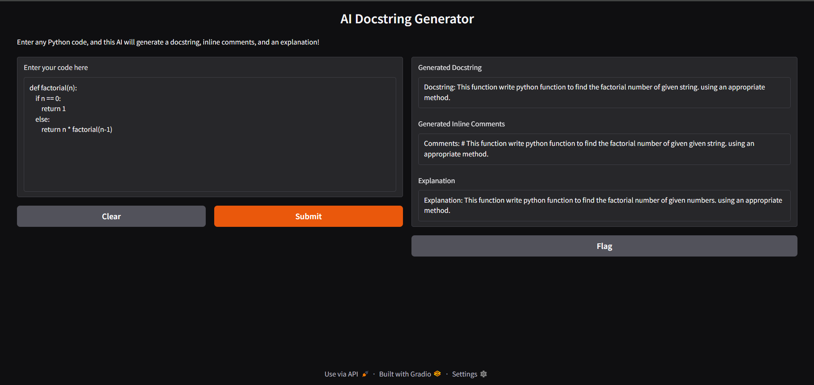

# 🌟 AI Docstring Generator

---

<div align="center">

[](LICENSE)
[](https://www.python.org/)
[](https://huggingface.co/docs/transformers/index)
[](https://gradio.app/)
[](https://github.com/yourusername/docstring-generator-ai/issues)

</div>

---

# 📖 Project Motivation

Developers often spend a lot of time writing **docstrings**, **inline comments**, and **brief explanations** for their code, especially when working collaboratively or submitting code for interviews, open-source projects, or production systems.

Manually writing these documentations can be:
- Time-consuming
- Boring for repetitive functions
- Easy to skip (leading to technical debt)

**Goal:** Build an **AI-powered tool** that can automatically:
- Generate clean **docstrings**
- Suggest **inline comments**
- Explain **code logic**

based on just a pasted Python function! 🚀

---

# 🔄 Model Fine-Tuning Details

- **Base Model:** [T5-Small](https://huggingface.co/t5-small)
- **Fine-tuning:** Applied **LoRA (Low-Rank Adaptation)** for memory-efficient training.
- **Dataset:** [mbpp - Mostly Basic Python Problems](https://huggingface.co/datasets/mbpp)
- **Custom Tasks:**
  - Docstring generation
  - Inline comments generation
  - Explanation generation

- **Training Device:** Personal laptop (RTX 3050 Laptop GPU, 4GB VRAM)
- **Libraries:** `transformers`, `datasets`, `peft`, `gradio`

---

# 🔧 Installation Guide
Follow these steps for **Windows**, **Mac**, and **Linux**:
```bash
# Clone this repository
$ git clone https://github.com/yourusername/docstring-generator-ai.git
$ cd docstring-generator-ai

# For Windows
$ python -m venv venv
$ venv\\Scripts\\activate

# For Mac/Linux
$ python3 -m venv venv
$ source venv/bin/activate

# Install required libraries
$ pip install -r requirements.txt

# Run the application
$ python app.py
```

The app will launch at: [http://127.0.0.1:7860/](http://127.0.0.1:7860/)

---

# 🎉 Features

- 🖊️ **Docstring Generation:** Generates clean, function-specific docstrings.
- 📚 **Inline Comments:** Adds helpful inline comments for better readability.
- 🔍 **Explanation:** Provides a brief summary of what the function does.
- 🌐 **Local Deployment:** No need for cloud APIs. Run it on your machine!
- 🧪 **Memory-Efficient:** Fine-tuned with LoRA for low VRAM systems.

---

# 🚫 Challenges Faced

- **GPU Out of Memory Errors:**
  - Solved by reducing model size to T5-small and using LoRA fine-tuning.

- **Low-quality outputs initially:**
  - Fixed by structuring prompts properly and training separately for each task.

- **Token Overwriting During Preprocessing:**
  - Solved by creating separate datasets for docstrings, comments, and explanations.

- **Limited Deep Code Understanding:**
  - T5-small + mbpp dataset can handle basic explanations, but complex recursion/memory topics need larger models + better datasets.

---

# 🔄 Future Improvements

- ✨ Fine-tune on larger code datasets like CodeParrot, CodeContests.
- ✨ Use T5-Base or CodeT5+ models for deeper reasoning.
- ✨ Add support for JavaScript, Java, C++ docstring generation.
- ✨ Implement a "beautify output" feature (auto formatting).

---

#  Usage Screenshot



---

# 💼 License

This project is licensed under the **Apache 2.0 License** - see the [LICENSE](LICENSE) file for details.

---

# 📄 Citation

If you use this project, please consider citing it or giving it a star on GitHub! 💫

